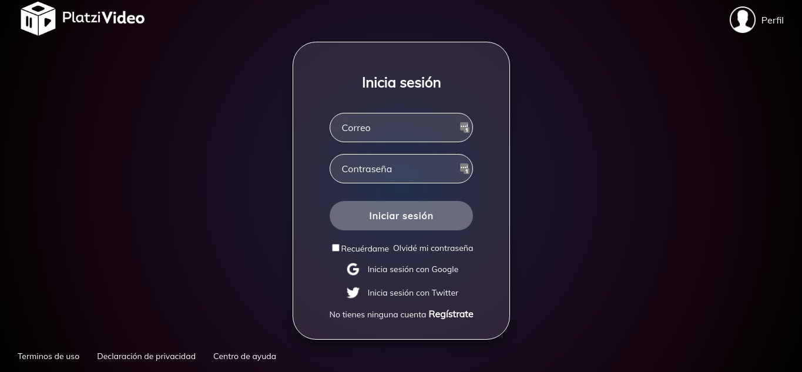
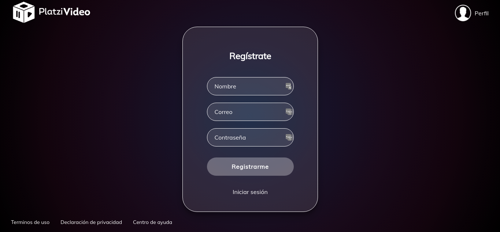
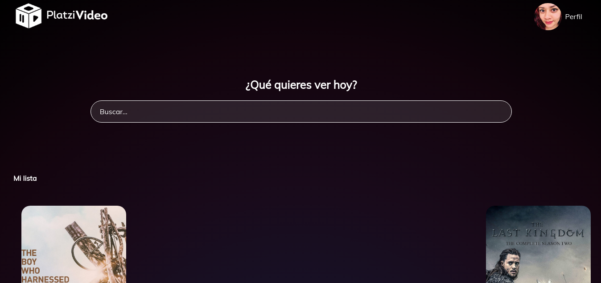
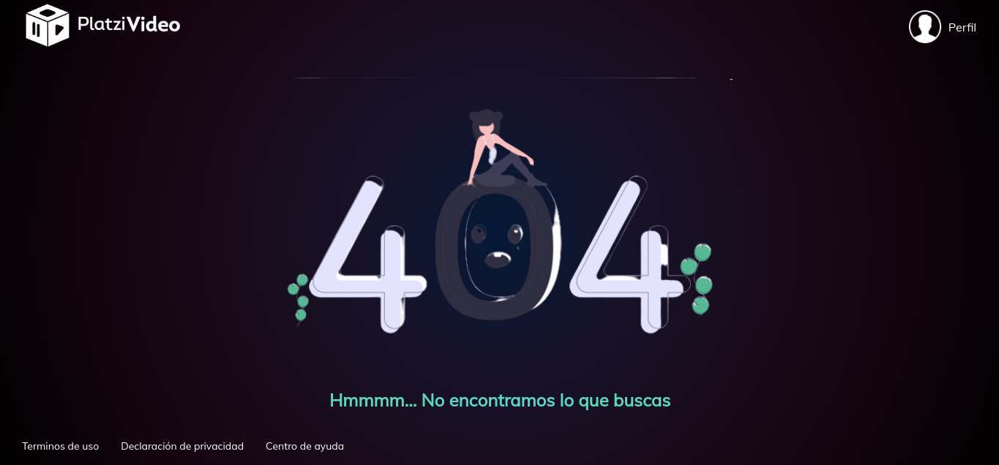
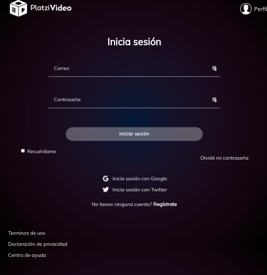
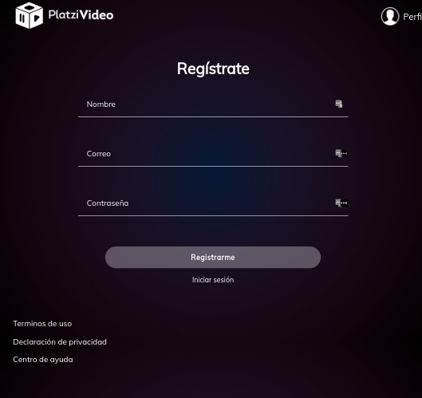

# Proyecto-PlatziVideo

This is the creation of the Frontend for the PlatziVideo project using React.js

### [DEMO](https://platfix.herokuapp.com/)

### Install

```sh
npm install
```

### Run Tests

```sh
npm run test
```

### Stack

- React.js
- Redux
- SASS
- Webpack
- Babel

## Preview


### Login



### Register




### Home




### 404




## Adaptive mode


### Login



### Register




## Authors

👤 **Guiselle Mejía <guissmejia@gmail.com>**

- Github: [@guissmejia](github.com/guissmejia)
- LinkedIn: [in/guiselle-mejia](https://www.linkedin.com/in/guiselle-mejia/)


## 📝 License

Copyright © 2020 [Guiselle Mejía <guissmejia@gmail.com>](https://github.com/guissmejia).

This project is [MIT](https://github.com/guissmejia/Proyecto-PlatziVideo/blob/develop/LICENSE) licensed.
